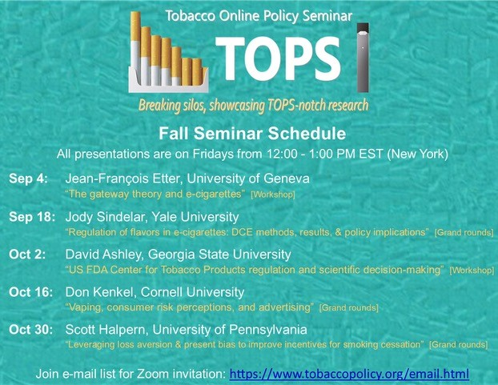

# Tobacco Online Policy Seminar (TOPS)

Welcome to the official website for **Tobacco Online Policy Seminar (TOPS)**. You can find information about the schedule, view past seminars, find calls for papers, sign up for email list, read the seminar guidelines and disclosure requirements, and learn about other free online seminars.  

[**TOPS Video Introduction**](https://youtu.be/EAtI1YA4ldU)

## About

The goal of the Tobacco Online Policy Seminar (TOPS) is to provide a free multidisciplinary, international forum for research using experimental or quasi-experimental variation (i.e., a well-defined counterfactual) to study nicotine-tobacco policies, with a particular interest in emerging tobacco products and modified risk tobacco products. This forum is designed to bring together academics, government scientists, students/trainees, funders, healthcare professionals, and advocates, with the goal of breaking silos in tobacco policy research and providing a platform for high-quality research to be discussed and disseminated. The ultimate goal of the forum is to facilitate the production and sharing of knowledge that can be used to develop an effective tobacco policy.

## Schedule

## Links

- [Schedule](./schedule.md)
- [Call for Papers](./call.html)
- [Email List](./email.md)
- [About](./about.html)

<!--
- The [AEA list of online seminars](https://www.aeaweb.org/resources/online-seminars)
-->

<!--
- [Google calendar link](https://calendar.google.com/calendar/embed?src=4p7jc9qc9igeb83pmkpjgi80fg%40group.calendar.google.com&ctz=America%2FLos_Angeles) and the calendar in [iCal format](https://calendar.google.com/calendar/ical/4p7jc9qc9igeb83pmkpjgi80fg%40group.calendar.google.com/public/basic.ics)
-->

## Support or Contact

Contact TOPS by emailing tobpolicy(at)gmail(dot)com or by Twitter [@TobPolicy](https://twitter.com/TobPolicy).
