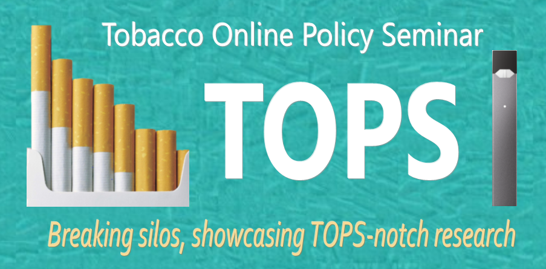
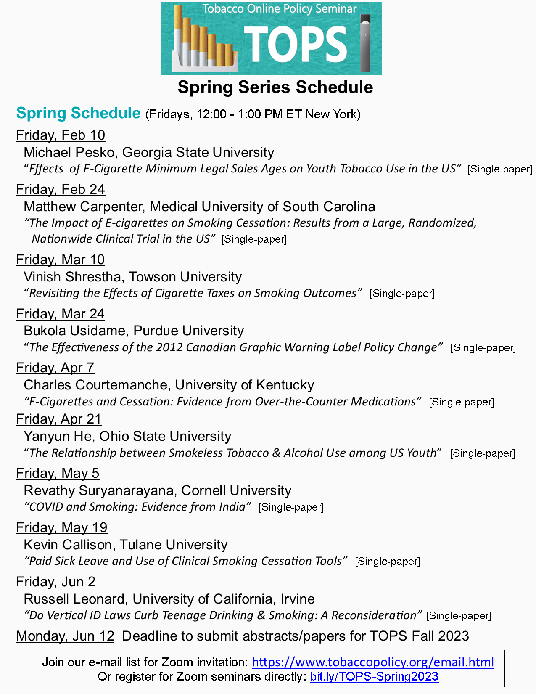

# Tobacco Online Policy Seminar (TOPS)

Welcome to the official website for **Tobacco Online Policy Seminar (TOPS)**. You can find information about the schedule, view past seminars, find calls for papers, sign up for email list, read the seminar guidelines and disclosure requirements, and learn about other free online seminars.  

[**TOPS Video Introduction**](https://youtu.be/EAtI1YA4ldU)

## About

The Tobacco Online Policy Seminar (TOPS) is a free multidisciplinary, international forum for research with tobacco policy implications using experimental or quasi-experimental study designs (i.e., with a well-defined counterfactual). TOPS strives to be a respectful, inclusive, and diverse forum, with participants and attendees united around the concept of presenting and learning from tobacco research using study designs capable of producing results with a causal interpretation, with the ultimate goal being the production and sharing of knowledge to develop an effective tobacco policy framework for improving population health. This forum is designed to bring together academics, students, government employees, policy researchers, healthcare professionals, advocates,  and funders, with the goal of breaking silos in tobacco policy research and providing a platform for high-quality research to be discussed and disseminated.

## Schedule

The schedule is updated regularly as new seminars are added to the series. 

[Join our email list](https://www.tobaccopolicy.org/email.html) to be notified about upcoming events. [Register](https://gsu-edu.zoom.us/webinar/register/WN_QBxCQ1owTFumB3iTSzPAjA) for the TOPS Series.

<!--
- The [AEA list of online seminars](https://www.aeaweb.org/resources/online-seminars)
-->

<!--
- [Google calendar link](https://calendar.google.com/calendar/embed?src=4p7jc9qc9igeb83pmkpjgi80fg%40group.calendar.google.com&ctz=America%2FLos_Angeles) and the calendar in [iCal format](https://calendar.google.com/calendar/ical/4p7jc9qc9igeb83pmkpjgi80fg%40group.calendar.google.com/public/basic.ics)
-->

## Support or Contact

Contact TOPS by emailing tobpolicy(at)gmail(dot)com or by Twitter [@TobPolicy](https://twitter.com/TobPolicy).
