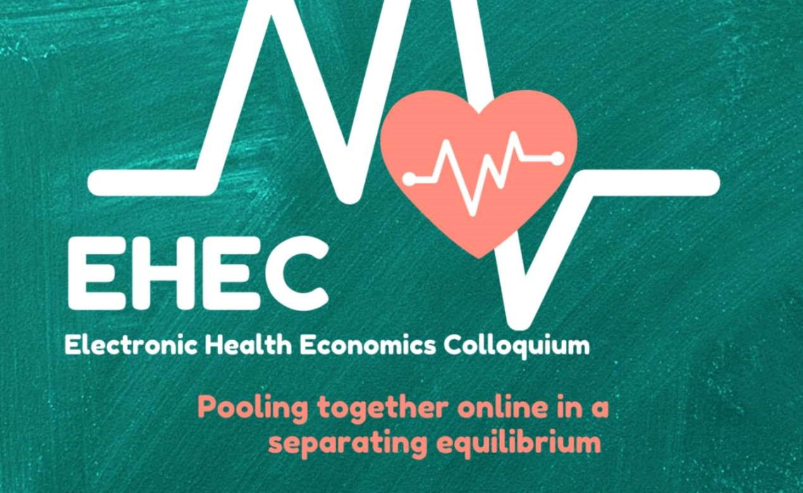
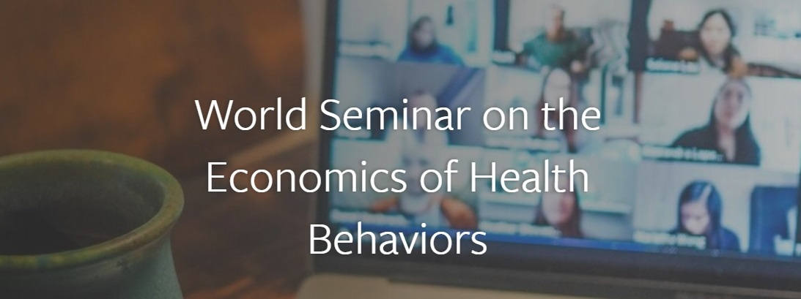

## Other Seminars

- Here is a link to the [Electronic Health Economics Colloquium (EHEC)](https://www.ehealthecon.org) which is an online seminar series on Health Economics and Policy.

- [The World Seminar on the Economics of Health Behaviors](https://www.human.cornell.edu/pam/research/hehbad/worldseminars) shares information on the economics of health behaviors, including smoking, alcohol abuse, drug abuse, poor diet, physical inactivity, obesity, risky sex, self-harm, and suicide.

